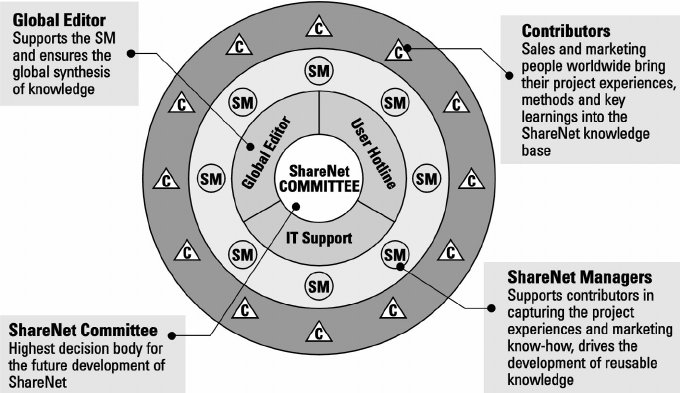
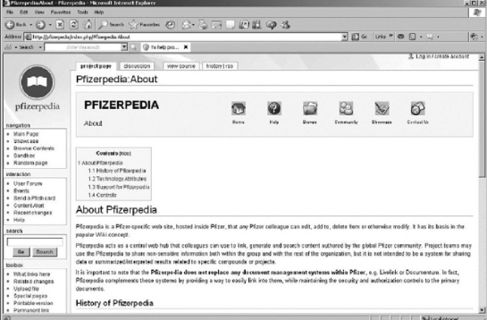

```{r, echo=FALSE}
library(metathis)
meta() %>% 
  meta_description(params$event) %>% 
  meta_name("github-repo" = paste0("datactivist/", params$slug)) %>% 
  meta_viewport() %>% 
  meta_social(
    title = params$title,
    url = paste0("https://datactivist.coop/", params$slug),
    image = params$image,
    image_alt = params$image_alt,
    og_type = "website",
    og_author = "Datactivist",
    og_locale = "fr_FR",
    og_site_name = "Datactivist",
    twitter_card_type = "summary",
    twitter_creator = "@datactivi_st")

```

layout: true

<style>
.remark-slide-number {
  position: inherit;
}

.remark-slide-number .progress-bar-container {
  position: absolute;
  bottom: 0;
  height: 4px;
  display: block;
  left: 0;
  right: 0;
}

.remark-slide-number .progress-bar {
  height: 100%;
  background-color: #e95459;
}

</style>


`r paste0("<div class='my-footer'><span>", params$event, "</span> <center><div class=logo><a href='https://datactivist.coop/'></a></div></center></span></div>")` 


---

class: center, middle

Ces slides en ligne : `r paste0("http://datactivist.coop/", params$slug)`

Sources : `r paste0("https://github.com/datactivist/", params$slug)`


Les productions de Datactivist sont librement réutilisables selon les termes de la licence [Creative Commons 4.0 BY-SA](https://creativecommons.org/licenses/by-sa/4.0/legalcode.fr).

<BR>
<BR>


---
## 1. Qu'est-ce que la connaissance ?

### Commençons par .red[un exemple]

#### Quelle serait la .red[**pire**] façon d'apprendre une recette de cuisine ?

---

## 1. Qu'est-ce que la connaissance ?

### Commençons par .red[un exemple]

#### Quelle serait la .red[**pire**] façon d'apprendre une recette de cuisine ?

- Une liste d'ingrédients 
- Des instructions

.center[.reduite[]]

---

## 1. Qu'est-ce que la connaissance ?

### Commençons par .red[un exemple]

#### Quelle serait la .red[**meilleure**] façon d'apprendre une recette de cuisine ?

1. **Lire une recette** : apprendre la théorie

2. **Observer un chef** : mémoriser une expérience

3. **Reproduire la recette** : pratiquer une compétence

4. **Obtenir les retours du chef** : obtenir des réponses dans un contexte

5. **Enseigner la recette à d'autres** : modéliser la connaissance et l'imprimer

---
## 1. Qu'est-ce que la connaissance ?

### Elle provient de .red[différentes sources :]

- .red[**Pratique**] : gestion de projet, bricolage, pratiques numériques...

- .red[**Théorie**] : formations et apprentissages qui nous permettent de modéliser des relations entre des objets, ou des évènements.

- .red[**Expériences**] : vécu pro et perso, une culture, des habitudes, des comportements

- .red[**Contexte**] : des connaissances liées à une situation (clients, secteur d'activité, concurrence...)

---
## 1. Qu'est-ce que la connaissance ?

### Elle se distingue en .red[deux nature :]

#### .red[**Connaissance tacite**]

Elle est informelle et intuitive et souvent **difficile à formaliser** ou à communiquer. Elle est souvent liée à des compétences pratiques, des expériences, des savoir-faire, des intuitions ou des sentiments.

#### .red[**Connaissance explicite**]

Elle est **formelle et systématisée** et peut être facilement communiquée, **codifiée et transmise**. Elle est souvent liée à des informations, des données, des règles, des procédures, des lois, des théories ou des concepts.

---
## 1. Qu'est-ce que la connaissance ?

### Mais cette approche qui .red[distingue tacite et explicite] est critiquée

Paul M. Hildreth & Chris Kimble parlent plutôt d'une [**dualité**](http://informationr.net/ir/8-1/paper142.html) : 

- La transmission des connaissances, mêmes explicites, ne permet pas de tout restituer

- Le knowledge management doit permettre de transmettre les aspects "durs" et "mous" de la connaissance.

- La connaissance est plutôt **un spectre** : avec à l'extrême un aspect "semi-conscient" et à l'autre un aspect complètement structuré et codifié. "La majeure partie [...] se situe au milieu" (*Leonard & Sensiper, 1998*)

---
## 2. Knowledge management dans les organisations


### .red[Pour quoi faire ?]

- Gagner en productivité

- Conserver les connaissances, lorsque les employés partent : quid de la dépendance aux expert•e•s clés

- Améliorer la formation des équipes avec des procédés innovants (peer learning, micro learning...)

- Briser les silos qui se forment (même dans les petites organisations !)

---
## 2. Knowledge management dans les organisations

### .red[Siemens AG ShareNet] 

Siemens a créé dans les années 1990 un système de knowledge management. 

- Un système de partage de connaissances **codifiées** ET **personnalisées**

- La **taxonomie** (qualification des informations et objets) a une importance capitale

- Les managers sont chargés de développer des **connaissances réutilisables**

- Ils passent **50 % de leur temps** à cette tâche

- **Des actions Siemens sont distribuées** par exemple lorsqu'une réponse urgente est apportée rapidement


[Source : "Knowledge Management in Theory and Practice" de Kimiz Dalkir](https://nibmehub.com/opac-service/pdf/read/Knowledge%20Management%20in%20Theory%20and%20Practice%20by%20Kimiz%20Dalkir-%20Jay%20Liebowitz.pdf)

---
## 2. Knowledge management dans les organisations

### .red[Siemens AG ShareNet]

Des **éditeurs**, **contributeurs** et **managers**



[Source : "Knowledge Management in Theory and Practice" de Kimiz Dalkir](https://nibmehub.com/opac-service/pdf/read/Knowledge%20Management%20in%20Theory%20and%20Practice%20by%20Kimiz%20Dalkir-%20Jay%20Liebowitz.pdf)

---
## 2. Knowledge management dans les organisations

### .red[Canadian International Development Agency (CIDA)]

L'Agence s'est rendue compte qu'elle avait dépensé $100 millions pour produire des connaissance qu'elle avait déjà.

- Ouverture au public des données et des contenus créés

- Création de groupes d'expertises 

- Collaboration systématique sur les outils en ligne  avec les partenaires et parties prenantes

---
## 2. Knowledge management dans les organisations

### .red[Pfizerpedia]

Création d'un wiki pour partager les connaissances sur les médicaments

- Créé en 2006

- Informations bottom-up : les équipes R&D pouvaient utiliser les connaissances créées

- Devenu partie intégrante de la culture de l'entreprise



---
## 3. Mise en pratique

### .red[Distinguer les temporalités de contenus]

#### Exemple chez Etalab :

- Les contenus **instantannés** : Mattermost
- Gestion de **projet et doc interne** : Notion
- Contenus durables : **sites internet et blog**

**Peut-on faire cette distinction** dans notre organisation ?
---
## 3. Mise en pratique

### .red[Connaissances tacites]

#### Comment mieux partager nos connaissances tacites ?

- Déjà : quelles connaissances tacites partager ? (expérience, savoirs-faires...)
- Quels formats seraient les plus propices ? (en dehors des communautés)

---
## 3. Mise en pratique

### .red[Qui fait quoi ?]

#### Quels roles attribuer ?

- Tous créateurs de contenus ?
- Des formateurs pour transmettre la connaissance ?
- Responsables de contenus par thématiques ?
- Un seul coordinateur dans l'organisation ?
- Aucun rôle spécifique ?

**Identifiez-vous d'autres rôles ?**

---
## 3. Mise en pratique

### .red[Comment inciter ?]

#### ..pour parvenir à une meilleure gestion des connaissances ?

- Faciliter la contribution ?
- Se concentrer sur la réutilisation de contenus pour faire gagner du temps au quotidien ?
- Générer des statistiques de consultation ? (pour le contenu ouvert)
- **Autre chose ?**

---
class: inverse, center, middle

# Merci !

Contact : [etienne@datactivist.coop](mailto:etienne@datactivist.coop)


